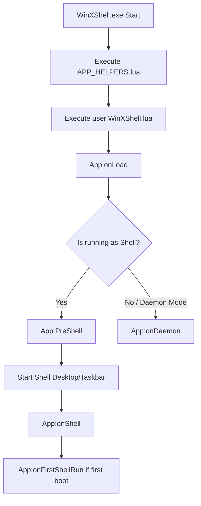

# WinXShell App Event Handlers (on* Events)

This document provides documentation for all available `App:on*` and application lifecycle callback functions that WinXShell executes. These functions can be overridden in `WinXShell.lua` to run custom code at key startup and run-time events.

---

## 1. Lifecycle Event Flow Diagram
When WinXShell starts, events are dispatched by the C++ engine to the Lua interpreter in the following order:

---

## 2. Event Handler Reference

### `App:onLoad()`
* **Trigger:** Executed immediately after WinXShell finishes loading both `APP_HELPERS.lua` and the user's `WinXShell.lua` profile.
* **Description:** Used for early environment initialization, command-line parameter parsing, and executing pre-requisite startup processes (e.g. running background helpers).
* **Source Callback:** Fired by `LuaApp.Call(":onLoad")` in C++.

### `App:PreShell()`
* **Trigger:** Executed right before the shell draws desktop workspace and taskbar panels.
* **Description:** Allows scripts to run configuration adjustments (like resolution changes or folder preparation) before the visual shell UI elements start rendering.
* **Source Callback:** Fired in `explorer.cpp` before drawing the main workspace containers.

### `App:onShell()`
* **Trigger:** Executed immediately after the shell successfully starts up and renders the taskbar, tray clock, and desktop icons.
* **Description:** Standard hook to initialize custom tray applets (e.g. `wxsUI('UI_WIFI')`, `wxsUI('UI_Volume')`) and configure general shell settings. Internally, the engine runs `App:_onShell` first (which registers context menus, system properties, and modern protocols) before invoking this callback.

### `App:onFirstShellRun()`
* **Trigger:** Fired immediately after `App:onShell()` *only* if the system has just booted and this is the first execution of the shell.
* **Description:** Ideal for running one-off environment setup tasks that must only run once per boot (such as playing startup sounds or running initial setup wizards).

### `App:onDaemon()`
* **Trigger:** Fired when WinXShell starts in background/daemon mode (e.g., when the main shell is managed by standard Windows explorer, but WinXShell runs to intercept protocols and context menus).
* **Description:** Used to register background handlers and context menus. Internally, the engine executes `App:_onDaemon` first to apply UWP protocols, file manager hooks, and properties integration.

### `App:onTimer(tid)`
* **Trigger:** Fired periodically whenever an active timer interval expires.
* **Arguments:** 
  * `tid` *(integer)*: The ID of the timer that triggered the event (set using `App:SetTimer(id, interval)`).
* **Description:** Used for checking system states, updating custom indicators, or executing tasks at fixed intervals.
